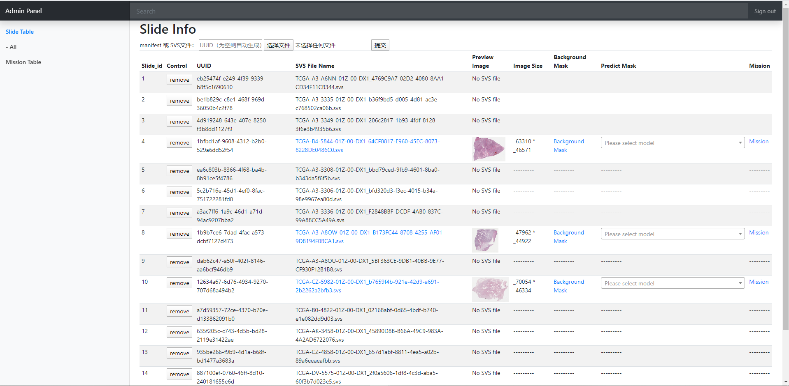
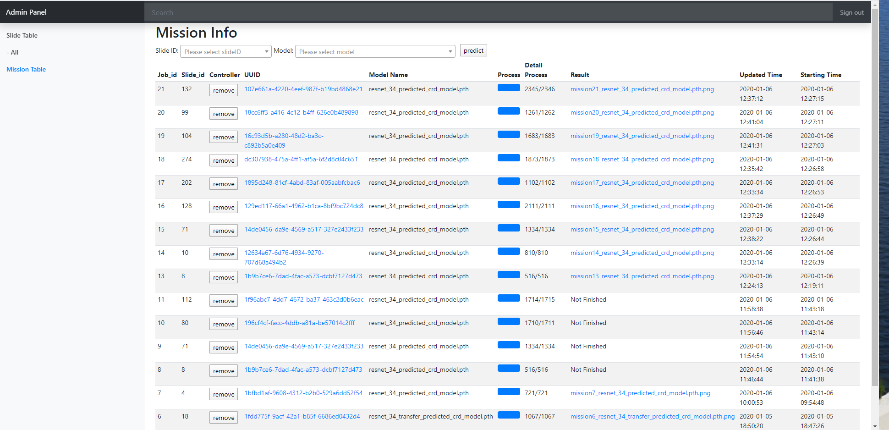
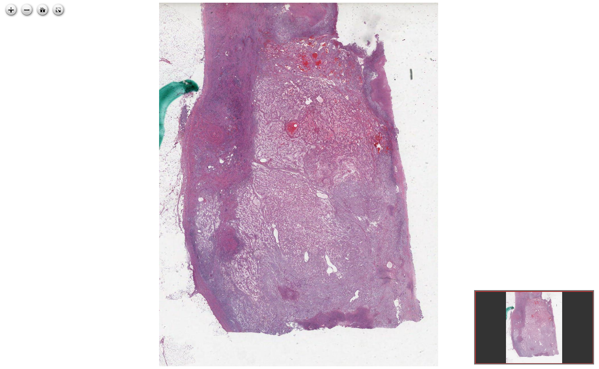
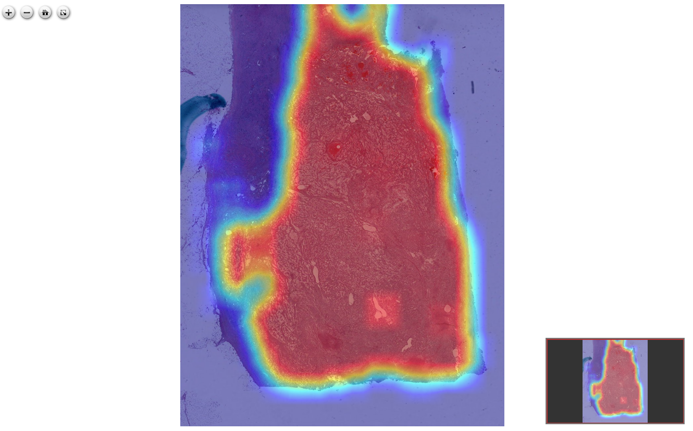

# WSI online analysis framework
## What is it
* WSI-online-analysis-framework is a framework to build a svs file online viewing and analyzing server.
* If you want the model or svs file for testing, you can download from 
[google drive](https://drive.google.com/open?id=1Cip_Al14PLIOyVS9jaG5SQ-RBlMEA3Iq).
 or you can send an email to zhanghaichuan1998@gmail.com to ask for help.
* The window size of the model input is 2000*2000. If you want to train the model by yourself, please pay attention to it.

## Performance
### Slide Table page

### Mission Table page

### Slide page without mask

### Slide page with mask


## How to install it
### Install required software and libraries

* software requirement
    * OpenSlide
    * MySQL(or other database software)
    * Git

* Python Library requirement
    * openslide-python==1.1.1
    * opencv-python==4.1.1.26
    * Pillow==6.2.1
    * torch==1.3.1
    * torchvision==0.4.2
    * numpy==1.17.4
    * mysql-connector==2.2.9
    * Flask==1.1.1
* You can install python library with this command:
```
     pip install -r requirements.txt
```

### Clone this repository with git and get in the folder
```
    git clone https://gitlab.com/6zhc/wsi-online-analysis-framework.git
    cd wsi-online-analysis-framework
```

### Creat database or reset the database
* Edit config.ini file to set the config of database.

```
    [db]
    host = localhost    # the host of the database
    user = root         # the user account of the database
    passwd = 123456     # the password of the database
    database = test     # the name of database
```

* Run the create_data_base.py.
```
    python create_data_base.py
```

### Import the trained model
* Put the trained model (pth file) into the models folder
```
    cp your_model_path models
```

### Run the framework
* To set the configure for the Flask, you can set the environment variable.(Optional)
    * eg. ```export FLASK_ENV=development``` 
    * For more information you can visit Flask official document
* Run command ```python -u -m flask run``` or ```flask run``` to start a server.
* To change the host, ip or other thing. You can add options after the command. (Optional)
    * eg. ```python -u -m flask run --host=0.0.0.0 --ip==8080```
    * For more information you can run command ```python -u -m flask --help```
            Usage: python -m flask run [OPTIONS]

              Run a local development server.
            
              This server is for development purposes only. It does not provide the
              stability, security, or performance of production WSGI servers.
            
              The reloader and debugger are enabled by default if FLASK_ENV=development
              or FLASK_DEBUG=1.
            
            Options:
              -h, --host TEXT                 The interface to bind to.
              -p, --port INTEGER              The port to bind to.
              --cert PATH                     Specify a certificate file to use HTTPS.
              --key FILE                      The key file to use when specifying a
                                              certificate.
              --reload / --no-reload          Enable or disable the reloader. By default
                                              the reloader is active if debug is enabled.
              --debugger / --no-debugger      Enable or disable the debugger. By default
                                              the debugger is active if debug is enabled.
              --eager-loading / --lazy-loader
                                              Enable or disable eager loading. By default
                                              eager loading is enabled if the reloader is
                                              disabled.
              --with-threads / --without-threads
                                              Enable or disable multithreading.
              --extra-files PATH              Extra files that trigger a reload on change.
                                              Multiple paths are separated by ':'.
              --help                          Show this message and exit.
            
            
## How to use it
### Upload manifest file / SVS file 
* Turn to slide_table page
* Input the UUID (if you want to assign the svs file with specific UUID) (Optional)
* Choose the manifest file / svs file.
* Click 提交(submit) button.
* Wait for a few seconds(or minutes depending on internet speed(svs file) or file size(manifest file)).
            
### Predict the SVS file.
* In slide_table page:
    * Choose a model in the "Predict Mask" column
* In mission_table page:
    * Choose the slide id and model.
    * Click "predict" button.
    
### Remove/reload the mask in the slide page.
* Click 'B' on the keyboard.

# Project Layout
- Controller
    - manifest_controller.py
    - mission_controller.py
    - dataset_controller.py
    - dzi_online_controller.py
    - thread_controller.py
    - image_processing.py
- Model
    - create_database.py
    - manifest.py 
    - mission.py
- templates (View)
    - slide_table.html
    - mission_table.html
    - slide.html
    - warning.html (Shown after uploading files)
    - dashboard.html (developing)
    - graph.html (developing)
- static
    - js/css files (Not detailed here) 
    - icon files (Not detailed here) 
    - data (soft link to Data folder)
- Data (Created by app.py or created by yourself)
    - folder named by UUID (Not detailed here) 
        - svs file
        - icon.png (used to show in the slide table)
        - smaller_image.png (1/16 times the pixel size of the original picture)
        - background_mask.png (the mask of the background, the same size of smaller_image)
        - mission_{mission_id}_{model name}.png (the result of mission, the same size of smaller_image)
- app.py (Main file)
- config.ini (Configure file)
- test.py (for testing use)
- create_database.py (the same as the file in the Model folder)
- README.md
